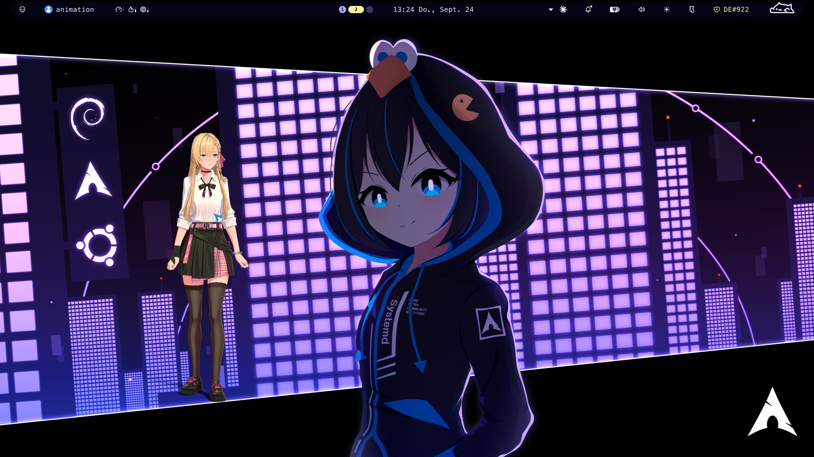

# Animates (Ani) on Linux – Wayland / niri edition



This builds on **psre423p45's guide [Animates-Ani-on-Linux](https://github.com/psre423p45/Animates-Ani-on-Linux)**, which gets Animates running under Heroic + GE-Proton on KDE Plasma (X11). Please read that first. The binary patches in `bin/patch-animates.py` come from it.

This repo adds what was missing on a **Wayland tiling compositor (niri)** with a **hybrid Intel + NVIDIA laptop**. It also includes one fix that helps **every** Linux user: by default, the animation AI runs on all CPU cores whenever Ani talks.

Tested on CachyOS, niri 26.04, GE-Proton11-7, Animates 1.0.9, and an i5-12450H with Intel UHD + RTX 3050 Laptop.

## What's different from the original guide

| Problem | Original guide | This repo |
|---|---|---|
| Transparent background | KWin effect (KDE X11 only) | Wine **Wayland driver** plus a tiny **Vulkan layer** that switches the swapchain to premultiplied alpha. Unity already renders real per-pixel alpha, so the edges come out clean. Works on any Wayland compositor that honors alpha. |
| All CPU cores at 100 % while Ani talks | not mentioned | Wine's `dxcore` stubs make the animation AI (ONNX Runtime) fall back to the CPU. A locally patched `dxcore.dll` lets it use **DirectML on the GPU** via vkd3d-proton. |
| Hybrid GPU laptops | – | Unity **draws on the iGPU** and the AI **computes on the dGPU**. Nothing ever presents NVIDIA-rendered buffers to the compositor, because that crashed niri. |
| Push-to-talk | python-xlib daemon (X11) | **evdev** daemon that works everywhere, no grab. **Hold** Right Alt to talk, **tap** it for a text chat prompt. |
| Text chat | app's own input window | That window can't be shown under Wine-Wayland, so a native **zenity** prompt sends messages through the same app API. |
| Sticky window | – | niri has no sticky windows, so a small service moves Ani to whichever workspace you're on. |
| Escape hatch | – | `ani-ctl`: switch view modes, for example to get out of PiP when the context menu isn't reachable, open chat, send text. |
| Launcher | Heroic sideload | A plain launch script plus a `.desktop` entry. It re-applies the patches after every Animates auto-update. |

Results on the test machine while Ani talks:

| Setup | CPU load |
|---|---|
| Stock | ~1100 % (all 12 threads) |
| Patched dxcore, AI on the RTX 3050 | ~700 % |

Two of the app's models (`inbetween_*`, `body_enc`) are CPU-only by design. Idle load is about 40 %.

## Requirements

- Linux with a Wayland compositor. niri is tested. Others should work for transparency, but the `follow` service is niri-only.
- **GE-Proton11-7** in `~/.local/share/Steam/compatibilitytools.d/`.
- `python3`, `curl`, `unzip`, a C compiler, Vulkan headers (`vulkan-headers` on Arch, `libvulkan-dev` on Debian/Ubuntu), and `zenity` for the chat prompt.
- For push-to-talk, your user must be in the `input` group.
- The official installer `Animates.exe` from [animates.ai](https://animates.ai). Download it yourself.

## Install

```bash
git clone https://github.com/animatedbug/animates-linux-wayland ~/animates-linux-wayland
cd ~/animates-linux-wayland
./install.sh ~/Downloads/Animates.exe
```

The installer does the following:
- writes `~/.config/animates-linux.conf` and auto-detects a discrete GPU
- creates the prefix in `~/Games/Animates`
- installs Animates and downloads the WebView2 109 fixed runtime from nuget.org
- applies the patches and builds the patched `dxcore.dll` and the alpha layer
- optionally installs the push-to-talk and workspace-follow user services

It does **not** edit your compositor config. For niri, add the rules from [`niri/animates.kdl`](niri/animates.kdl): floating, no border, no focus ring, no background fill.

Start Ani with `animates` or from your app launcher.

## Configuration

`~/.config/animates-linux.conf` (see [`config.example`](config.example)):

| Key | Values | Meaning |
|---|---|---|
| `WAYLAND` | `1` / `0` | Transparent Wayland mode, or XWayland with a black background |
| `DML_MODE` | `dgpu` / `igpu` / `cpu` | Where the animation AI runs. `igpu` works but Ani may stutter, because the iGPU also draws her. |
| `DGPU_PCI_ID` | e.g. `10de:25a2` | The dGPU that runs DirectML (`lspci -nn`) |
| `UNITY_DEVICE_INDEX` | `1` | DXGI index of the iGPU. DXVK lists the dGPU first. |
| `PTT_KEY` | `KEY_RIGHTALT` | evdev key name for push-to-talk |

## How it works (details)

### Transparency

- Animates renders its character with real alpha: on Windows it uses `DwmExtendFrameIntoClientArea` plus per-pixel transparency.
- DXVK creates its swapchain as `VK_COMPOSITE_ALPHA_OPAQUE`. The implicit Vulkan layer in [`alpha-layer/`](alpha-layer/) intercepts `vkCreateSwapchainKHR` and asks for `PRE_MULTIPLIED` instead.
- With the Wine Wayland driver (`PROTON_ENABLE_WAYLAND=1`), the swapchain is a native `wl_surface`, so the compositor blends it.
- The layer is only active when `ANIMATES_ALPHA_LAYER=1`.

### GPU for the animation AI

- `AnimationCPP.dll` picks the ONNX Runtime execution provider by asking DXCore for adapters with `D3D12_GRAPHICS` / `D3D12_CORE_COMPUTE`.
- Wine's `dxcore` is a semi-stub: `IsAttributeSupported` / `IsPropertySupported` always return FALSE, so everything runs on `CPUExecutionProvider`.
- [`dxcore/make-dxcore.py`](dxcore/make-dxcore.py) patches **your local copy** of Proton's `dxcore.dll`. It finds both functions by symbol name and makes them return TRUE. Nothing from Wine is redistributed.
- The launcher puts the copy into the prefix's `system32` (callers use `LOAD_LIBRARY_SEARCH_SYSTEM32`) and sets:
  - `WINEDLLOVERRIDES=dxcore=n,b`
  - `WINE_D3D_CONFIG=renderer=vulkan`, because Wine's dxcore enumerates adapters through wined3d and the GL path fails under the Wayland driver.
- Verified with [`tools/`](tools/): DirectML 1.15 on vkd3d-proton reaches feature level 6.4 on both Intel (ANV) and NVIDIA.

### Hybrid GPU split

- Wine's dxcore only reports the first Vulkan device, and ONNX Runtime passes that adapter to vkd3d-proton. `MESA_VK_DEVICE_SELECT=<dgpu>` puts the dGPU first, so DirectML computes there.
- Unity would also pick the dGPU (DXGI adapter 0), so it gets `-force-device-index 1` to draw on the iGPU.
- WebView2 gets `--disable-gpu`.

**Why this matters:** when a Wine-Wayland window presented buffers rendered on the NVIDIA GPU while niri composited on the Intel GPU, niri aborted inside Mesa (`dri_create_fence_fd`) and the whole session was lost. With the split above, only the iGPU ever presents.

## Security notes (read these)

- **WebView2 109** (Chromium from early 2023, known CVEs) runs with `--no-sandbox` and loads the Animates login/UI from the internet.
- `--remote-debugging-port=9222` is needed for push-to-talk, chat and `ani-ctl`. While Ani runs, **any local process can execute JavaScript in your logged-in session** through that port.
  - It only listens on localhost.
  - This repo drops the original guide's `--remote-allow-origins=*`, so websites in your browser can't reach it. The helpers connect without an Origin header.
- The binary patches modify the vendor's files, which may conflict with Animates' terms. Auto-updates overwrite them. The launcher re-applies them only if the MD5 matches 1.0.9. Otherwise it stops and notifies you.

## Known issues

- Transparent areas of the 600×800 window still catch mouse clicks, because there is no input region under Wayland.
- The app's own text input and some popups are invisible under Wine-Wayland. Use the chat prompt or `ani-ctl`. The right-click context menu works.
- The app can't move its own window on Wayland. Move it with your compositor (niri: Mod + drag).
- The binary patches only fit Animates 1.0.9. For newer versions, see the original guide on how to re-derive the offsets.

## Troubleshooting

- Log: `~/Games/Animates/last-run.log`
- Unity log: `…/AppData/LocalLow/Animation Inc_/animation/Player.log`. Check `Renderer:` to see which GPU draws.
- Is DirectML in use? `grep -i directml /proc/$(pgrep -f 'current.Animates.exe' | head -1)/maps`
- Which GPU does the AI use? `nvidia-smi` lists `Animates.exe` when it runs on the NVIDIA GPU.
- Stuck in PiP or another view mode: `ani-ctl mode transparent`

## Credits

- [psre423p45](https://github.com/psre423p45/Animates-Ani-on-Linux): the original guide and the four Wine patches.
- GloriousEggroll (GE-Proton), the Wine, DXVK and vkd3d-proton projects.

Animates is © Animation Inc. This project is unofficial and not affiliated with them.
